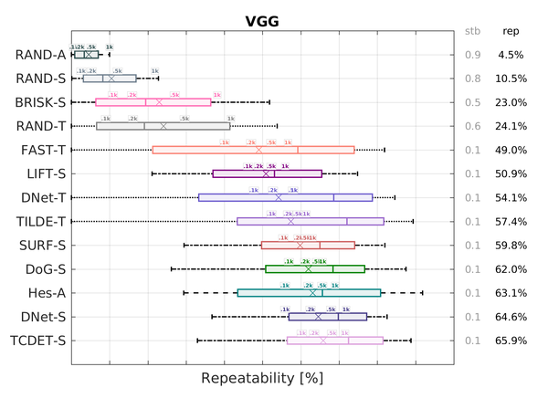

# VLB-Deteval

Source code for *Large scale evaluation of local image feature detectors on homography datasets*. Paper describing this protocol is to be published in BMVC 2018. The manuscript can be also found in [ArXiv](https://arxiv.org/abs/1807.07939).

This project is based on the VLB project (*VLFeat benchmark*) and is written in MATLAB. However, it is possible to run it with MATLAB SDK which is freely avaliable ([link](./MCR.md)).

Most of the standard tasks can be invoked by a command line interface `de` which can be directly invoked from MATLAB. At start, the code automatically compiles the requested files, this for MATLAB, mex needs to be configured.

## Installation
If you own a MATLAB 2017a (probably older version should work too), you can start using this software directly, using the source code after provisioning.
However, ass the license cost of MALTAB might be prohibitive, you can also use a binary distribution, which uses freely available MATLAB Compiler Runtime (MCR). More details on how to use with MCR can be found [here](./MCR.md).

### Set-up
To set up the MATLAB environment and to compile the VLB mex files, simply run:
```matlab
>> de
```
This also shows the list of available commands.

### Provision data files
To download the compact archive with only the final results of each detector (800kiB), run:
```matlab
>> de provision scores-compact
```
This is all provisioning which is needed to be able to plot the results and compare them yo your own detector.


To download all the results data, which allows to view the per-image results (2.3GiB), run:
```matlab
>> de provision scores-all
```
However, please note that to download all the results data, the original dataset has to be downloaded as well.


Additionally, you can also download all the detected keypoints (573MiB), e.g. to recompute all the results using:
```matlab
>> de provision features
```

## Reproduce BMVC results
To reproduce BMVC results, you can simply download the original features and
re-run the computations (might take few hours):
```matlab
>> de provision features
>> de results expdef/bmvc_results.json
```

This will create the results figures and the rank table in `./data/results/bmvc_results/`.
The figures are exported in png and tikz format. Rank table is in LaTex format. The figures should look like the following example:



If you have already provisioned the scores files, the results are not recomputed.

## Visualising image matches
To visualise the image matches, the full score files must be aither computed or provisioned.
Additionally, a dataset of the original images will be downloaded on demand.

### Visualise an image pair
To visualise and image pair of a dataset (task), run:
```matlab
>> de view matchpair <datasetname> <taskid>
```

For example, calling `view matchpair vggh 1` results in:


Please note that the dataset will be downloaded if not present.


### Visualise detected keypoints
To visualise and image pair of a dataset (task), run:
```matlab
>> de view detections <datasetname> <featsname> <imid>
```
this assumes that the features of `featsname` are provisioned in `./data/features/featsname`.

For example, calling `view detections vggh m-surf-ms 1` results in:


Please note that the dataset will be downloaded if not present.


### Visualise keypoints matching results
To visualise and image pair of a dataset (task), run:
```matlab
>> de view matches <benchmarkname> <datasetname> <featsname> <taskid>
```
this assumes that all scores are either provisioned or computed. The benchmark name
is e.g. `bmvc_results_100` which is the repeatability for the top-100 features.

For example, calling `view matches bmvc_results_1000 vggh m-surf-ms 1` results in:


Please note that the dataset will be downloaded if not present.

## Evaluate a new detector
For details how to evaluate a new detector, please see the following [section](./evaluatedet.md).


## Authors

* **Karel Lenc** - *Initial work* - [lenck](https://github.com/lenck)

## Citation

Please cite us if you use this code:

```
@article{VlbDet18,
 author = {Karel Lenc and Andrea Vedaldi},
    title = "{Large scale evaluation of local image feature detectors on homography datasets}",
    journal = {BMVC},
    year = 2018,
    month = sept
}
```
