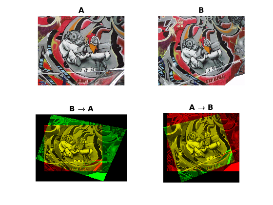
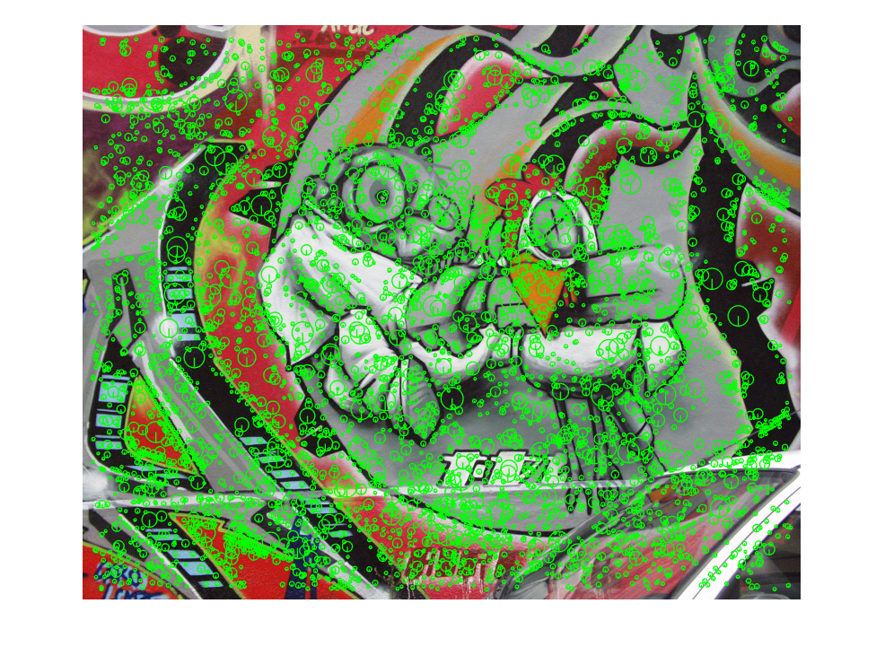
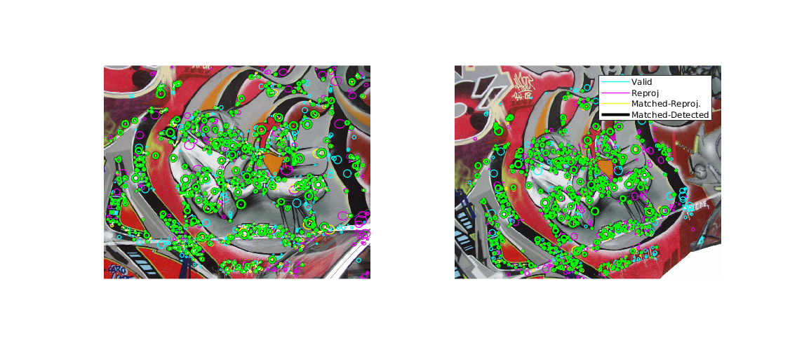

# VLB-Deteval

Source code for *Large scale evaluation of local image feature detectors on homography datasets*. Paper describing this protocol is to be published in BMVC 2018.

This project is based on the VLB projec - VLFeat benchmark - and is written in MATLAB. However, it is possible to run it with MATLAB SDK which is freely avaliable.


## Installation
If you own a MATLAB 2017a (probably older version should work too), you can start using this software directly, using the source code and you can skip to step 3.
However, ass the license cost of MALTAB might be prohibitive, you can also use a binary distribution, which uses freely available MATLAB Compiler Runtime.

<a id=install-mcr></a>

### 1. Install MCR
The command line interface requires either MATLAB R2017a or the MATLAB Compiler Rumtime (MCR) installed. If you do not have MATLAB, you can download and install the MCR for free as follows:

* [Download MCR for Linux 64-bit](http://www.mathworks.com/supportfiles/downloads/R2016a/deployment_files/R2017a/installers/glnxa64/MCR_R2017a_glnxa64_installer.zip)
Download the zip archive, unpack and run the `./install` script.
* [Download MCR for Windows 64-bit](http://www.mathworks.com/supportfiles/downloads/R2016a/deployment_files/R2017a/installers/win64/MCR_R2017a_win64_installer.exe)
Download and run the `.exe` installer.
* [Download MCR for Mac 64-bit](http://www.mathworks.com/supportfiles/downloads/R2016a/deployment_files/R2017a/installers/maci64/MCR_R2017a_maci64_installer.zip)
Download the zip archive, unpack and run the `./install` script.

More details how to install the MCR can be found [here](http://www.mathworks.com/products/compiler/mcr/).
Please note that around 2GB of free space is required.

### 2. Get the binary distribution
To download the binary distribution of the VLB-Deteval, run:
```
./get_bin.sh
```

### 3. Provision data files
To download the compact archive with only the final results of each detector (800kiB), run:
```
./bin/run_de.sh provision scores-compat
```
This is all provisioning which is needed to be able to plot the results and compare them yo your own detector.


To download all the results data, which allows to view the per-image results (2.3GiB), run:
```
./bin/run_de.sh provision scores-all
```
However, please note that to download all the results data, the original dataset has to be downloaded as well.


Additionally, you can also download all the detected keypoints (573MiB), e.g. to recompute all the results using:
```
./bin/run_de.sh provision features
```

## Reproduce BMVC results
To reproduce BMVC results, you can simply download the original features and
re-run the computations (might take few hours):
```
./bin/run_de.sh provision features
./bin/run_de.sh results expdef/bmvc_results.json
```

This will create the results figures and the rank table in `./data/results/bmvc_results/`.
The figures are exported in png and tikz format. Rank table is in LaTex format.

If you have already provisioned the scores files, the results are not recomputed.

## Visualising image matches
To visualise the image matches, the full score files must be aither computed or provisioned.
Additionally, a dataset of the original images will be downloaded on demand.

### Visualise an image pair
To visualise and image pair of a dataset (task), run:
```
./bin/run_de.sh view matchpair <datasetname> <taskid>
```

For example, calling `view matchpair vggh 1` results in 
. Please note that the dataset
will be downloaded if not present.


### Visualise detected keypoints
To visualise and image pair of a dataset (task), run:
```
./bin/run_de.sh view detections <datasetname> <featsname> <imid>
```
this assumes that the features of `featsname` are provisioned in `./data/features/featsname`.

For example, calling `view detections vggh m-surf-ms 1` results in 
. Please note that the dataset
will be downloaded if not present.


### Visualise keypoints matching results
To visualise and image pair of a dataset (task), run:
```
./bin/run_de.sh view matches <benchmarkname> <datasetname> <featsname> <taskid>
```
this assumes that all scores are either provisioned or computed. The benchmark name
is e.g. `bmvc_results_100` which is the repeatability for the top-100 features.

For example, calling `view matches bmvc_results_1000 vggh m-surf-ms 1` results in 
. Please note that the dataset
will be downloaded if not present.


## Evaluating your own detector
To evaluate your detector, you need to first compute the keypoints for all images of a dataset and store them in an appropriate location.
Afterwards, you can specify your own experiment by creating a new experiment definition JSON file.
With these, you can use the provided code to compute the results and generate the final figures.

### 1. Storing keypoints in a correct location
In order to do so, the keypoints and their feature responses has to be stored in an apropriate location
in a CSV file.
In order to simplify the process, the code can download the dataset and generate the appropriate paths for you
simply by running:
```
./bin/run_de.sh imagelist <featsname>
```
this will download all datasets (if not present) and create a set of files named
`./data/imagelists/<datasetname>-<featsname>.csv`
which contains three fields per line, one line per dataset image:
```
<input image path>;<target keypoint CSV path>;<target keypoint response path>\n
...

``` 
All paths are absolute paths.

Keypoints are stored in simple CSV files with one keypoint per line.
The code supports multiple formats,
as specified by [vl_feat](http://www.vlfeat.org/matlab/vl_plotframe.html).


More information about the geometric frame definitions can be found [here](http://www.vlfeat.org/api/covdet-fundamentals.html).
Different parameters of a keypoint are typically separated by a semicolon.

E.g. an output of a simple grid-like detector (all radius 10) would be:
```
0;0;10
0;1;10
0;2;10
...
```

Similarly, feature responses are also stored as one response per line.
It is assumed that keypoints with higher response value are obtained with a detector with higher selectivity.

You can check if your features are exported correctly by plotting the detections with:
```
./bin/run_de.sh view detections <datasetname> <featsname> <imid>
```


### 2. New experiment definition
Create your own detector definition, e.g. by copying an existing detector:
```
cp ./expdefs/dets/detnet-s.json ./expdefs/dets/<featsname>.json
```
and simply update the `./expdefs/dets/<featsname>.json` file by specifying
LaTeX name, color and a target invariance of your detector.

Copy the existing BMVC experiment to a new json file, e.g.:
```
cp ./expdefs/bmvc_results.json ./expdefs/my_soa_results.json
```
and add your detector definition to the detectors section. Eventually, you
can redue the number of selected detectors.

### 3. Compute the results
You can then compute your results simply with:
```
./bin/run_de.sh results expdef/my_soa_results.json
```
which will store all the results in `./data/results/my_soa_results`.
Please not that this might take a while as it recomputes all the results
from the BMVC experiment. Also make sure that you provision the features
of other detectors before continuing.


## Authors

* **Karel Lenc** - *Initial work* - [lenck](https://github.com/lenck)

## Citation

Please cite us if you use this code:

```
@article{VlbDet18,
 author = {Karel Lenc and Andrea Vedaldi},
    title = "{Large scale evaluation of local image feature detectors on homography datasets}",
    journal = {BMVC},
    year = 2018,
    month = sept
}
```
